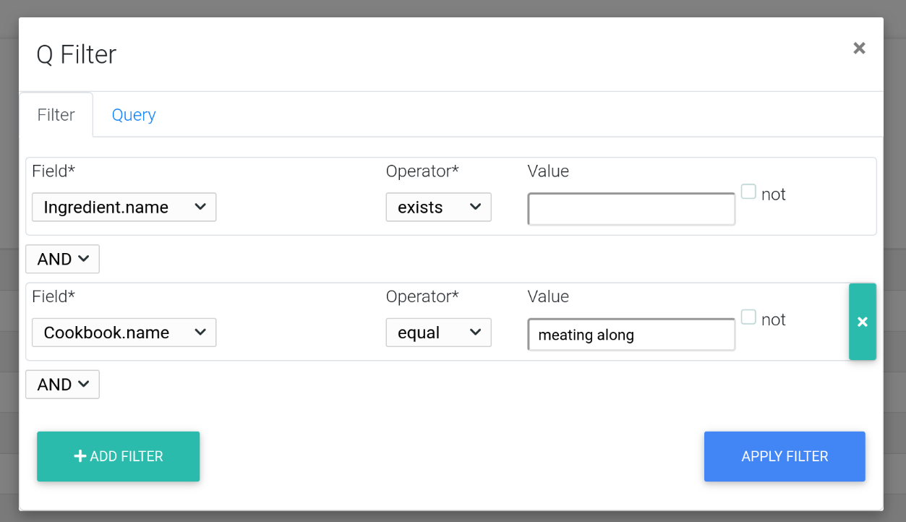
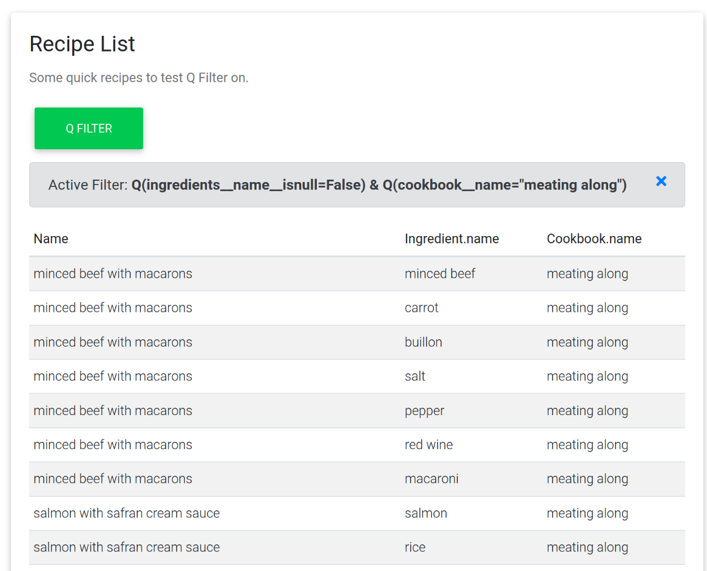

# Django Q Filter

[![build-status-image]][travis]
[![coverage-status-image]][codecov]
[![pypi-version]][pypi]

**complex filtering based on Django Q**

## Overview

Use the power of [Django Q Objects](https://docs.djangoproject.com/en/3.1/topics/db/queries/#complex-lookups-with-q-objects) to filter django models with complex queries.
Django Q Filter provides filter forms (based on bootstrap and jQuery) and utils for complex query filters.

The filter form selects the possible django model fields dynamically and computes a Q-Query with the given input.


the resulting queryset is automatically annotated with the field and values of the given Q-Query. results of a Q-Query are always a "joined" style list and to enhance the experience, a normalized result set can be computed, where the values can be merged.



For demo purposes, an example project is provided.

----

## Requirements

* Python (3.6, 3.7, 3.8, 3.9)
* Django (2.2, 3.0, 3.1)
* django-crispy-forms

## Installation

Install using `pip`...

    pip install django-q-filter

Add `'qfilter'` to your `INSTALLED_APPS` setting.

```python
    INSTALLED_APPS = [
        ...
        'qfilter',
    ]
```

Use Q-Filter mixin in django views. See example project.

```python
# example/food/views.py

class RecipeListView(QQueryViewMixin, ListView):
    """
    Recipe List View
    """
    model = Recipe
    template_name = 'food/recipe_list.html'
    ordering = ['name']
```

[build-status-image]: https://secure.travis-ci.org/bpereto/django-q-filter.svg?branch=master
[travis]: https://travis-ci.org/bpereto/django-q-filter?branch=master
[coverage-status-image]: https://img.shields.io/codecov/c/github/bpereto/django-q-filter/master.svg
[codecov]: https://codecov.io/github/bpereto/django-q-filter?branch=master
[pypi-version]: https://img.shields.io/pypi/v/django-q-filter.svg
[pypi]: https://pypi.org/project/django-q-filter/